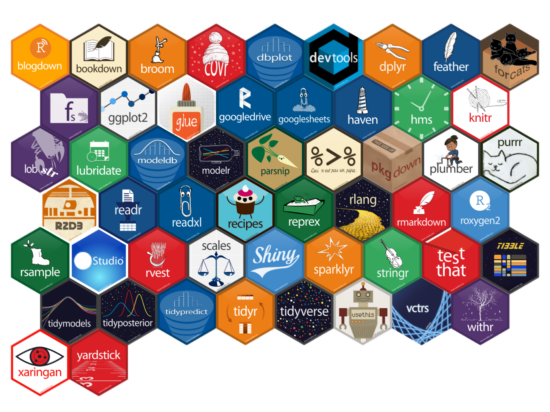
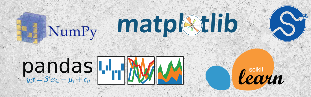

```{css, echo = FALSE}
:root {--sidebar-background-color: #f3ec13ad;}
    
#awards > ul {padding-left: 0px;}
    
p {text-align: justify;}
  
.section.level2 {margin-top: 0px;}

#aside {padding-top: 0px;}
  
#disclaimer > p {padding-left: 30px;}

[alt=picture] {border-radius: 50%;
                display: block;
                margin-left: auto;
                margin-right: auto;}
```


Aside
================================================================================

{width=70%}


Contact Info {#contact}
--------------------------------------------------------------------------------

- <i class="fa fa-envelope"></i> alfonso.tobar@alumnos.usm.cl
- <i class="fab fa-linkedin"></i> ["alfonso-tobar-arancibia-788b0868"](https://www.linkedin.com/in/alfonso-tobar-arancibia-788b0868/)
- <i class="fa fa-github"></i> [github.com/Rcubes](https://github.com/Rcubes)
- <i class="fa fa-phone"></i> +56 9 95551157 


Skills {#skills}
--------------------------------------------------------------------------------

- <i class="fab fa-r-project"></i> Advanced R Developer:
- 18 Datacamp Certifications

<center>
{width=100%}
</center>

- <i class="fab fa-python"></i> Advanced Python: 
- 37 Datacamp Certifications
- Machine Learning [Scientist](https://www.datacamp.com/statement-of-accomplishment/track/d878bdcbdbeed77a7f4a011cfccf9853fc3c8c53)
- Machine Learning [Fundamentals](https://www.datacamp.com/statement-of-accomplishment/track/d4979aaa53fb640dfe5138d44578eec1cae17177)

<center>
{width=100%}</center>

- <i class="far fa-chart-bar"></i> Advanced Tableau Developer
- <i class="fas fa-database"></i> Advanced SQL User
- <i class="fas fa-file-excel"></i> VBA Basic Level

Awards {#awards}
--------------------------------------------------------------------------------
 
- <i class="fas fa-user-graduate"></i> Back-to-back Best DSP Trainer
- <i class="fas fa-cogs"></i> Employee Performance Award


Main
================================================================================

Alfonso Tobar {#title}
--------------------------------------------------------------------------------

## Civil Engineer / Data Scientist

I am a Civil Engineer with a strong technical background working initially in Hydraulics moving later on to Data Science.

Within this area, I started at more traditional analytics such as getting involved into EDA, Text Mining Projects, developing Business Inteligence tools such as Interative Reports and Dashboards to finally be dedicated into one of my passions, developing Machine Learning Models. I had the opportunity to work in the Bank Industry as well as the Retail industry, working for Risks and Marketing Departments covering almost every topic on the Data Science Field.

My main skills cover proficient programming skills in R and Python, english fluency as a second language, self-learning motivation being always up-to-date, knowledge sharing spirit and the passion to always deliver the highest quality work to satisfy my stakeholders needs.

</br>

Education {data-icon=graduation-cap data-concise=true}
--------------------------------------------------------------------------------

### Federico Santa María Technical University

Civil Engineering.

Valparaiso, Chile

2013

Thesis: Stochastic Finite Element Models's Uncertainty Quantification by using Convolutional Networks.

### Data Scientist Program by SENCE

Data Scientist Graduate.

Viña del Mar, Chile

2015

### Valparaiso Pontifical Catholic University

Predictive Modeling and Machine Learning Diploma.

Viña del Mar, Chile

2019


Professional Experience {data-icon=suitcase}
--------------------------------------------------------------------------------

### Senior Data Scientist

Advanced Analytics Department.

Cencosud Scotiabank

::: concise
- Development of Predictive and Propensity Sales Models.
- Development of Collaborative Filtering Models. 
- Development of Clustering Models.
:::

2019 - 2020

Model Development in Python such as: 

- Linear Models: Logistic Regression, SVM.
- Ensamble Models: Random Forest, Extra Trees, LightGBM, XGBoost.
- Recommender Engines: implicit, lightFM.

### Senior Business Analyst

Data Analyst for the 3rd Major Bank in the US.

Evalueserve Chile

::: concise
- Development and Automation of Compliance Reports.
- Data Process Automation.
- Development of Calculation Engines.
- Design and Maintenence of Dashboards.
:::

2015 - 2019

### Production Analyst Elqui

Analyst for Drinking Water Services.
 
Aguas del Valle

2014 - 2015

::: concise
- Production Metrics Reporting.
- In charge of Decision-Making process to tackle drought issues.
:::

### Project Engineer

Project Engineer for Rural Drinking Water Projects.

INVAR S.A

::: concise
- Piping Network Design.
- Water Demand Estimation.
- Tank and Pumping System Design.
- Blueprint Generation.
:::

2013


Teaching Experience {data-icon=chalkboard-teacher}
--------------------------------------------------------------------------------

### Data Science Bootcamp

Data Science Instructor

Academia Desafío LATAM

2020

 - Online Classes for Introduction to Python, Data Science Fundamentals and Machine Learning modules.
 
### Data Scientist Program

R Module Lead.

Evalueserve Chile

2016 - 2019

 - In charge of Developing Program Syllabus.
 - Teaching the following classes:
 
::: concise
- Intro to R.
- Intro to Tidyverse.
- Data Wrangling.
- Data Reporting in R.
- Advance R Programming.
- Modeling and Machine Learning.
:::


### Data Scientist Program

Tableau Instructor.

Evalueserve Chile

2017 - 2019

::: concise
- Intro to Tableau.
- Basic Charts.
- Non Standard Charts.
- LOD.
- Tableau Advanced Tricks.
:::

### Data Scientist Program

SQL Instructor.

Evalueserve Chile

2018

::: concise
- Intro to SQL.
- Basic Queries.
- Aggregate Functions.
- Sub - Queries.
:::

### Federico Santa María Technical University

Teaching Assistant.

Valparaiso, Chile

2006 - 2013

- Calculus I.
- Calculus II.
- Calculus IV.

::: aside
This resume was made with the R package [**pagedown**](https://github.com/rstudio/pagedown).

Last updated on `r Sys.Date()`.

:::

<!-- Research Experience {data-icon=laptop} -->
<!-- -------------------------------------------------------------------------------- -->

<!-- ### Data Scientist Program -->

<!-- Research Project Assistant. -->

<!-- Evalueserve Chile -->

<!-- 2016 - 2019 -->

<!-- - Assisting DSP Students during their Research Projects. -->
<!-- - Topics Covered: -->

<!-- ::: concise -->
<!-- - Sentiment Analysis applied to Song Lyrics. -->
<!-- - Machine Learning applied to Fraud Detection. -->
<!-- - Topic Modeling applied to President Speeches. -->
<!-- - Machine Learning Applied to Sentiment Analysis. -->
<!-- ::: -->


<!-- Selected Publications and Posters {data-icon=file} -->
<!-- -------------------------------------------------------------------------------- -->

<!-- ### Genetic and epigenetic signals are found predictive to the distribution of intra-individual divergence of alternative splicing. -->

<!-- Poster for 2013 International Conference of Genomics -->

<!-- Qingdao, China -->

<!-- 2014 -->

<!-- **Yu L**, Chen B, Zhang Z. -->

<!-- ### ESCRT-0 complex modulates Rbf mutant cell survival by regulating Rhomboid endosomal trafficking and EGFR signaling. -->

<!-- J Cell Sci. 2016 May 15;129(10):2075-84. -->

<!-- N/A -->

<!-- 2016  -->

<!-- Sheng Z, **Yu L**, Zhang T, Pei X, Li X, Zhang Z and Du W.  -->
