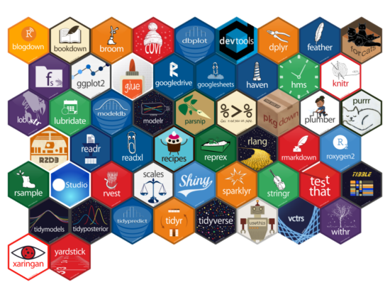
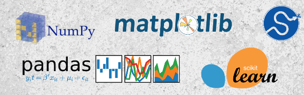

```{css, echo = FALSE}
:root {--sidebar-background-color: #f3ec13ad;}
    
#awards > ul {padding-left: 0px;}
    
p {text-align: justify;}
  
.section.level2 {margin-top: 0px;}

#aside {padding-top: 0px;}
  
#disclaimer > p {padding-left: 30px;}

[alt=picture] {border-radius: 50%;
                display: block;
                margin-left: auto;
                margin-right: auto;}
```


Aside
================================================================================

{width=70%}

Contacto {#contact}
--------------------------------------------------------------------------------

- <i class="fa fa-envelope"></i> alfonso.tobar@alumnos.usm.cl
- <i class="fab fa-linkedin"></i> ["alfonso-tobar-arancibia-788b0868"](https://www.linkedin.com/in/alfonso-tobar-arancibia-788b0868/)
- <i class="fa fa-github"></i> [github.com/Rcubes](https://github.com/Rcubes)
- <i class="fa fa-phone"></i> +56 9 95551157 

Habilidades {#skills}
--------------------------------------------------------------------------------

- <i class="fab fa-r-project"></i> R Avanzado:
- 18 Certificaciones Datacamp
<center>
{width=100%}</center>

- <i class="fab fa-python"></i> Python Avanzado: 
- 37 Certificaciones Datacamp
- Machine Learning [Scientist](https://www.datacamp.com/statement-of-accomplishment/track/d878bdcbdbeed77a7f4a011cfccf9853fc3c8c53)
- Machine Learning [Fundamentals](https://www.datacamp.com/statement-of-accomplishment/track/d4979aaa53fb640dfe5138d44578eec1cae17177)

<center>
{width=100%}</center>

- <i class="far fa-chart-bar"></i> Tableau Avanzado
- <i class="fas fa-database"></i> Usuario Avanzado SQL
- <i class="fas fa-file-excel"></i> VBA Nivel Básico

Reconocimientos {#awards}
--------------------------------------------------------------------------------
 
- <i class="fas fa-user-graduate"></i> 2 Veces Mejor Entrenador DSP
- <i class="fas fa-cogs"></i> Employee Performance Award

Main
================================================================================

Alfonso Tobar {#title}
--------------------------------------------------------------------------------

## Ingeniero Civil / Data Scientist

Soy un Ingeniero Civil con fuertes habilidades técnicas desempeñándome primeramente en el Área Hidráulica para luego entrar en el campo de la Ciencia de Datos.

Dentro de esta area, inicié dentro de la analítica más tradicional involucrándome en proyectos de Text Mining, desarrollo de Herramientas de Inteligencia de Negocios como Dashboards y Reportes Interactivos para luego dedicarme a una de mis pasiones, el desarrollo de modelos de Machine Learning. Me ha tocado trabajar en ambientes bancarios y de Retail, en áreas de Marketing y de Riesgo cubriendo casi todas las áreas de las ciencia de Datos.

Entre mis habilidades destacan mi alto dominio de Programación tanto en R como en Python, manejo de idioma inglés fluido, una constante actitud de autoaprendizaje y de mantenerme actualizado así como una pasión por la enseñanza, compartir conocimientos y entregar la mejor calidad de trabajo para satisfacer las necesidades de mis clientes.

</br>

Educación {data-icon=graduation-cap data-concise=true}
--------------------------------------------------------------------------------

### Universidad Técnica Federico Santa María

Ingeniería Civil.

Valparaiso, Chile

2013

Tesis: Cuantificación de la Incertidumbre de Modelos de Elementos Finitos Estocásticos mediante el Uso de Redes Neuronales Convolucionales.

### Data Scientist Program dictado por SENCE

Data Scientist.

Viña del Mar, Chile

2015

### Pontificia Universidad Católica de Valparaíso

Diplomado de Modelado Predictivo y Machine Learning.

Viña del Mar, Chile

2019


Experiencia Profesional {data-icon=suitcase}
--------------------------------------------------------------------------------

### Senior Data Scientist

Subgerencia de Advanced Analytics.

Cencosud Scotiabank

::: concise
- Desarrollo de Modelos Predictivos y Propensión de Venta.
- Desarrollo de Modelos de Filtrado Colaborativo.
- Desarrollo de Modelos de Clustering.
:::

2019 - 2020

Desarrollo de Modelos en Python tales como:

- Modelos Lineales: Logistic Regression, SVM.
- Ensambles: Random Forest, Extra Trees, LightGBM, XGBoost.
- Recommender: implicit, lightFM.

### Senior Business Analyst

Analista de Datos para el 3er mayor Banco de Estados Unidos.

Evalueserve Chile

::: concise
- Desarrollo y Automatización Reportes.
- Automatización de Procesos de Datos.
- Desarrollo de Motores de Cálculo.
- Diseño y Mantenimiento de Dashboards.
:::

2015 - 2019

### Analista de Produción Elqui

Analista de Servicios de Agua Potable.
 
Aguas del Valle

2014 - 2015

::: concise
- Reporte de Metricas de Producción.
- A cargo de Medidas de Mitigación de la Sequía.
:::

### Ingeniero de Proyectos

Ingeniero de Proyecto encargado de Proyectos de Agua Potable Rural.

INVAR S.A

::: concise
- Diseño Red de Tuberías.
- Estimación de Demanda de Agua.
- Diseño de Estanque y Systema de Bombeo.
- Generación de Planos.
:::

2013


Experiencia Docente {data-icon=chalkboard-teacher}
--------------------------------------------------------------------------------

### Data Science Bootcamp

Docente Data Science

Academia Desafío LATAM

2020

 - Clases Sincrónicas en los módulos de Introducción a Python, Fundamentos de Data Science y Machine Learning.
 
### Data Scientist Program

Líder Módulo de R.

Evalueserve Chile

2016 - 2019

 - A Cargo de Generar el Syllabus del problema.
 - A cargo de las siguientes clases:
 
::: concise
- Introducción a R.
- Introducción al Tidyverse.
- Armonización de Datos.
- Reporte de Datos en R.
- Programación Avanzada en R.
- Modelación y Machine Learning.
:::


### Data Scientist Program

Instructor de Tableau.

Evalueserve Chile

2017 - 2019

::: concise
- Introducción a Tableau.
- Gráficos Básicos.
- Gráficos Avanzados.
- LOD (Nivel de Detalle).
- Trucos Avanzados en Tableau.
:::

### Data Scientist Program

Instructor SQL.

Evalueserve Chile

2018

::: concise
- Introducción a SQL.
- Queries Básicas.
- Funciones de Agregación.
- Sub - Queries.
:::

### Universidad Técnica Federico Santa María

Ayudante de Cátedra.

Valparaiso, Chile

2006 - 2013

- Cálculo I.
- Cálculo II.
- Cálculo IV.

::: aside
Este CV se diseñó usando el Paquete de R [**pagedown**](https://github.com/rstudio/pagedown).

Actualizado el `r Sys.Date()`.

:::

<!-- Experiencia en Investigación {data-icon=laptop} -->
<!-- -------------------------------------------------------------------------------- -->

<!-- ### Data Scientist Program -->

<!-- Asistente de Proyectos de Investigación. -->

<!-- Evalueserve Chile -->

<!-- 2016 - 2019 -->

<!-- - Temas Tratados: -->

<!-- ::: concise -->
<!-- - Sentiment Analysis aplicado a letras de Canción. -->
<!-- - Machine Learning aplicado a detección de Fraude. -->
<!-- - Topic Modeling aplicado a Discursos Presidenciales. -->
<!-- - Machine Learning apliado a Sentiment Analysis. -->
<!-- ::: -->


<!-- Selected Publications and Posters {data-icon=file} -->
<!-- -------------------------------------------------------------------------------- -->

<!-- ### Genetic and epigenetic signals are found predictive to the distribution of intra-individual divergence of alternative splicing. -->

<!-- Poster for 2013 International Conference of Genomics -->

<!-- Qingdao, China -->

<!-- 2014 -->

<!-- **Yu L**, Chen B, Zhang Z. -->

<!-- ### ESCRT-0 complex modulates Rbf mutant cell survival by regulating Rhomboid endosomal trafficking and EGFR signaling. -->

<!-- J Cell Sci. 2016 May 15;129(10):2075-84. -->

<!-- N/A -->

<!-- 2016  -->

<!-- Sheng Z, **Yu L**, Zhang T, Pei X, Li X, Zhang Z and Du W.  -->